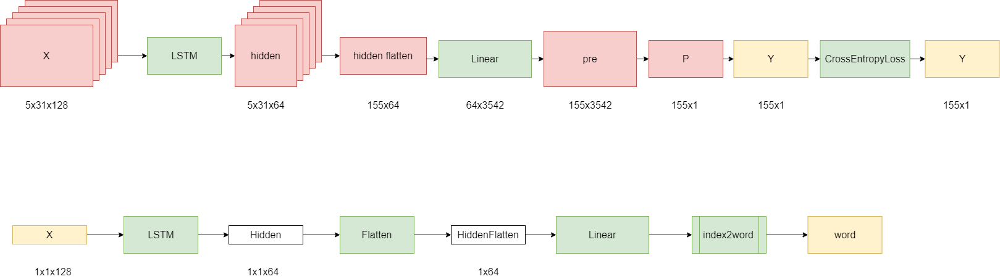

# Smart Bjfuer

> The RNN Model Bot Generate Chinese Poems Developed By BJFU Electronic Team with Scrum Process Framework

Coding Standard: [PEP-8](pep8.md)

Data Source: [Chinese Poetry](https://github.com/chinese-poetry/chinese-poetry)

### Dependence

- Python 3.8.3
- torch 1.9.0
- gensim 4.0.1
- numpy 1.20.0
- pickle-mixin 1.0.2

### Workflow

#### Model Training

