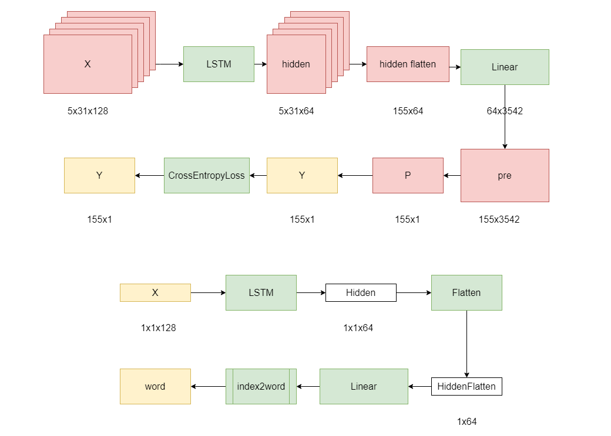

# Poem Generate

> The RNN Model Bot Generate Chinese Poems Developed with Scrum Process Framework

Coding Standard: [PEP-8](pep8.md)

Data Source: [Chinese Poetry](https://github.com/chinese-poetry/chinese-poetry)

Enter 4 Simplified Chinese characters (aka Hanzi / Chinese Kanji) then the model Generates a "4 sentences 7 words traditional Chinese poem", every sentence starts with the given character

## Result
Input characters
```
天色渐晚
```
Output poems (5 times the same Input)
```
天有学翻沙燕英，色朵鼻香生箫空。渐欲声翻沙似鸟，晚觉觉海总阴缫。
天治儒餐横喧工，色有朝畴耕对筑。渐挤浮观物枝槛，晚波丁徭环渐远。
天来秋莽斗绣空，色朝丁徭环故工。渐挤浮观物英沉，晚绣又享禄平久。
天野瓯粤原无扇，色饮狙犷料槟豕。渐花闻道长似停，晚觉瓯粤西无匹。
天撼儒餐力初城，色瀛璚角沙无城。渐来花气总幽森，晚开丁徭力渐纾。
```

## Dependency

- Python 3.8.3
- torch 1.9.0
- gensim 4.0.1
- numpy 1.20.0
- pickle-mixin 1.0.2
- flask 2.2.2

## Develop (recurrent)
### Use Anaconda
In anaconda create Python 3.8 environment and install dependencies

```
pip install gensim
pip install numpy 
pip install pickle-mixin
pip install flask
```
install pytorch via conda (CPU only) Recommanded
```
conda install pytorch==1.9.0 torchvision==0.10.0 torchaudio==0.9.0 cpuonly -c pytorch
```
or install pytorch via coda (CUDA 11)
```
conda install pytorch==1.9.0 torchvision==0.10.0 torchaudio==0.9.0 cudatoolkit=11.3 -c pytorch -c conda-forge
```

```cd``` to the project file and run main.py
```
python main.py
```

terminal output
```
 * Serving Flask app 'main'
 * Debug mode: off
WARNING: This is a development server. Do not use it in a production deployment. Use a production WSGI server instead.
 * Running on all addresses (0.0.0.0)
 * Running on http://127.0.0.1:5000
 * Running on http://192.168.1.112:5000
```

then open browser and go to ```http://127.0.0.1:5000```

### Debug
If there's error about torch devices (CPU and CUDA), please delete the pre-training model (```model.pkl```) and run ```python main.py``` again to re-training model

## Details

### Model Training and Poetry Generating



### About results

If the number of entered characters aren't 4 (even there's no character) or the entered characters aren't Simplified Chinese characters (like English or other Language), the model will still print a Chinese poem. Because the model uses the word vectors to forecast next character

Due to the small test model (300 poems dataset), the model may generate poems don't start with the entered characters which are never included by dataset